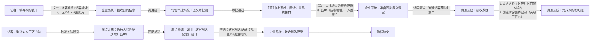

```mermaid
graph LR
    A[访客：填写预约表单] -->|提交：访客信息+访客地址（厂区ID）+人脸照片| B[企业系统：接收预约信息]
    B -->|调用接口| C[钉钉审批系统：提交审批流]
    C -->|审批通过| D[钉钉审批系统：回调企业系统接口]
    D -->|提取：审批通过的预约记录+厂区ID（访客地址）+人脸照片| E[企业系统：准备同步魔点数据]
    E -->|调用魔点【创建访客预约】接口| F[魔点系统：接收数据]
    F -->|1. 录入人脸至对应厂区门禁人脸库<br>2. 创建访客预约记录（关联厂区ID）| G[魔点系统：完成预约初始化]
    H[访客：到达对应厂区门禁] -->|触发人脸识别| I[魔点系统：执行人脸匹配（关联厂区ID）]
    I -->|匹配成功| J[魔点系统：调用【访客到达记录】接口]
    J -->|推送：访客到达记录（含厂区ID+到达时间）| K[企业系统：接收到达记录]
    K --> L[流程结束]
  
```